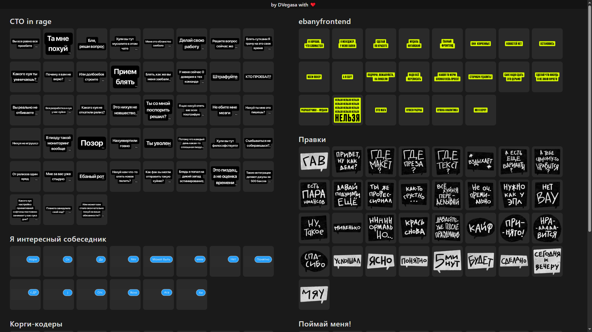

# Как добавить свои стикеры

1. **Создать папку** в корне репозитория (например, `my-stickers`).

2. **Добавить туда стикеры** в любом формате (png, jpg, gif и т.д.).

3. **Переименовать в порядковые имена.** В `./rename.sh` указать свою папку вместо текущей, затем выполнить:

   ```bash
   ./rename.sh
   ```

   Файлы станут `1.png`, `2.png`, … (расширение сохраняется).

4. **Привести PNG к одному размеру** (опционально, только для png):

   ```bash
   ./resize-png.sh my-stickers
   ```

   Изображения будут 128×128 px.

5. **Добавить раздел на сайт.** В `index.html` в массив `SECTIONS` добавить строку:

   ```js
   { folder: "my-stickers", title: "Название раздела", count: 10, ext: "png" },
   ```

   Укажите своё `folder`, `title`, количество файлов (`count`) и расширение (`ext`).

6. **Коммит, пуш, Merge Request** в репозиторий.

7. Тегни меня в телеграме (t.me/DVegasa) или в дискорде, чтобы я смерджил.

---

P.S. Сайт более чем на 95% был навайбкоден. Качество кода этого проекта не отражает качество кода моего продакшн-кода – мне нужно было решить личную проблему и я сделал это самым оптимальным и работающим способом.
